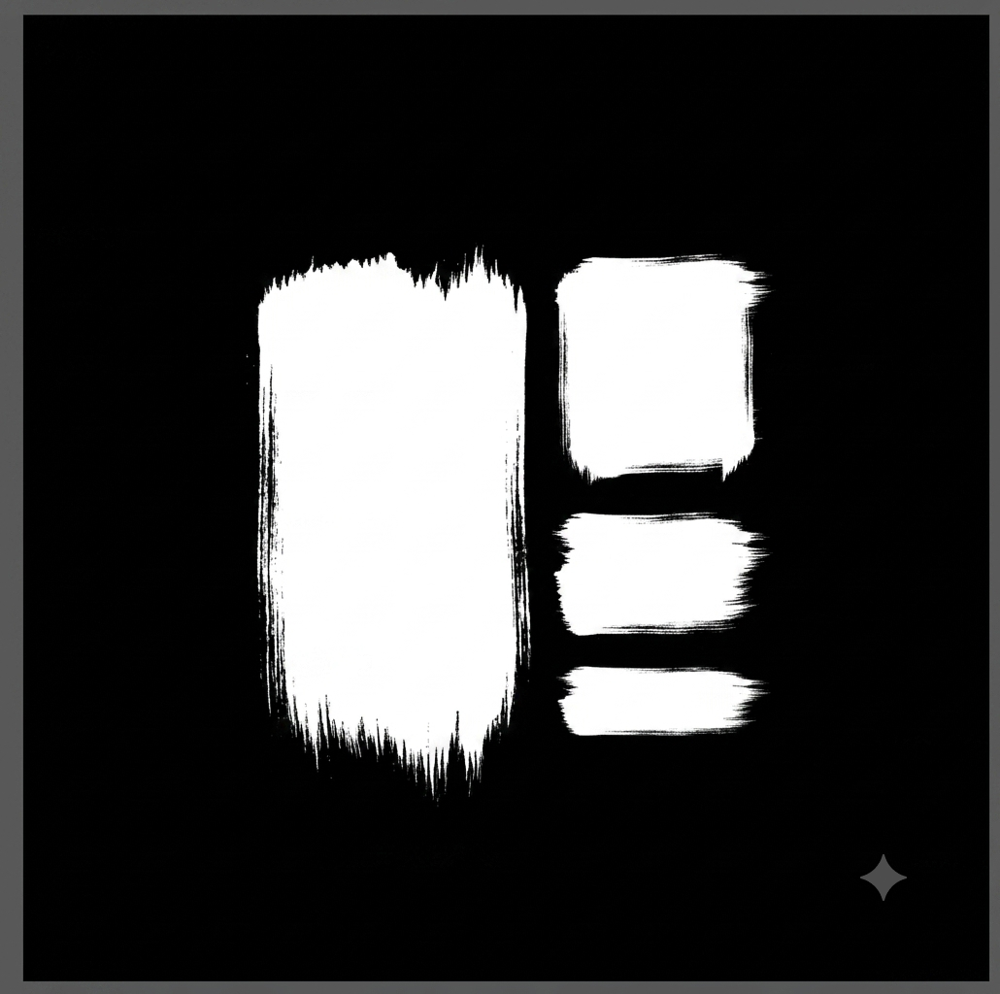

<p align="center">
  
</p>

<p align="center">
  
  
  
  
</p>

<p align="center">
  <strong>A terminal multiplexer in Rust — split panes, tabs, and sessions, driven by the keyboard or the command line.</strong><br>
</p>

# koshi

> ⚠️ **koshi is in active development.** The author uses it as a daily driver,
> so it changes often — commands, config fields, keybindings, and defaults can
> all shift between commits. Expect that to keep being true.

## Requirements

- A terminal emulator that supports **true color** and **256 colors** (any modern one does)
- **Linux**, **macOS**, or **Windows**
- **Rust 1.96+** — only if you build from source

## Description

koshi is a terminal multiplexer: it runs inside one real terminal window and
gives you many independent terminals inside it. Each pane owns its own shell,
its own screen, and its own scrollback. Panes tile inside a tab, tabs group into
a session, and a session keeps running whether or not you are looking at it.

To the terminal you launched it from, koshi is one program. To every shell it
starts, koshi *is* the terminal — it handles colors, cursor movement, and mouse
input itself, which is why programs like `vim`, `htop`, and `less` work normally
inside a pane.

Everything koshi can do has a name, and the aim is to let you reach it two ways:
press a key, or run a command.

## Why koshi?

koshi tries to keep its core small — sessions, tabs, panes, layout, and lock
mode — and leave the rest out of the binary. No Git panels, dashboards, or
launchers bundled in.

The other thing it aims at is being scriptable. Most actions are also commands
with real arguments, so what you do by hand you can usually do from a script, a
`Makefile`, or another program — aimed at a specific pane, tab, or terminal by
id.

## Features

- 🪟 **Split Panes** — split any pane left, right, up, or down; the panes fill the tab, with no gaps left behind
- 🗂️ **Stacked Panes** — put several panes in one slot and flip between them, instead of shrinking everything
- 🔍 **Fullscreen Zoom** — blow one pane up to the whole tab and back, without losing the layout
- 📐 **Exact Resize** — move a pane border by a set number of characters, by key or by dragging with the mouse
- 📑 **Tabs** — create, close, rename, reorder, and cycle tabs; the tab bar scrolls when it runs out of room
- 🖥️ **Sessions** — sessions keep running on their own; list them, look inside them, rename them, kill them
- 🔌 **Attach / Detach** — point a terminal at a running session, let it go again, or have several terminals on the same session at once
- ⌨️ **Multi-key Shortcuts** — chained keys (`<C-p> n`), a leader key you pick, a hint bar showing what comes next, and clash detection
- 🔒 **Lock Mode** — send every key straight to the program in the pane, so koshi's own shortcuts stop stealing them
- 🖱️ **Mouse Support** — click to focus, drag borders to resize, scroll each pane, double-click and drag to select
- 📋 **Copy to Clipboard** — select with the mouse and copy to your real clipboard, working over SSH too
- 🎯 **Mouse Select Mode** — take the mouse back from a full-screen program that is using it, so you can select text
- 📜 **Per-pane History** — each pane keeps its own scrollback and its own place in it
- 🧾 **Terminal Behavior** — true color, bold and italics, full-screen programs, wide characters like CJK and emoji, box drawing
- 🎨 **Themes** — 25 ready-made ones included (Dracula, Gruvbox, Nord, Catppuccin, Tokyo Night, Rosé Pine, Solarized, and more)
- ⚙️ **Simple Config Files** — app settings, themes, shortcuts, and saved layouts, each in its own readable file
- 💾 **Saved Layouts** — save a set of tabs, panes, and the commands they run, then open the lot with one flag
- 🖧 **CLI Control** — most actions are also commands, aimed at a specific pane, tab, or terminal by id
- 🔎 **See What's Running** — list and look inside sessions, tabs, panes, terminals, actions, and shortcuts, as a table or as JSON
- 🩺 **Doctor** — check your install and environment in one command
- 🔄 **Self Update** — check for and install a newer koshi
- 🪵 **Logging** — optional log file per session, plain text or JSON, recording ids and never your content
- 🌍 **Cross-platform** — Linux, macOS, and Windows

## Installation

> 🚧 **Coming soon.**

### Build from source

```bash
git clone https://github.com/gohyuhan/koshi.git
cd koshi
cargo build --release

# the binary lands here
./target/release/koshi
```

## Quick Start

Launch koshi:

```bash
koshi
```

That opens a new session with one tab and one pane running your shell.

### Default keybindings

The leader key is **Ctrl** by default, so the shortcuts below start with `Ctrl`
held down. Change the leader once and they all move together.

| Keys | Does |
|---|---|
| `<C-p> n` | New pane (default direction) |
| `<C-p> h` / `j` / `k` / `l` | New pane left / down / up / right |
| `<C-p> x` | Close the pane and everything it started |
| `<C-p> ←` `↓` `↑` `→` | Move focus to the neighbouring pane |
| `<C-s> ←` `↓` `↑` `→` | Move this pane's border one cell |
| `<C-t> n` | New tab |
| `<C-t> x` | Close tab |
| `Tab` / `Shift+Tab` | Next / previous tab |
| `Alt+f` | Toggle fullscreen on the focused pane |
| `<C-g>` | Toggle mouse select mode |
| `<C-l>` | Lock / unlock (keys pass straight to the program) |
| `<C-q>` | Quit |

Run `koshi keys list` to see the keymap actually in effect, and
`koshi actions list` for every action you can bind.

### Configuration

koshi reads four kinds of [KDL](https://kdl.dev) file, all optional. With none
of them, koshi runs on its built-in defaults.

| File | Sets |
|---|---|
| `koshi.kdl` | App settings: theme, scrollback, mouse, split direction, logging, updates |
| `themes/<name>.kdl` | Colors for borders, tab ribbon, and accents |
| `keybinding.kdl` | Key bindings and the modes they live in |
| `profile/<name>.kdl` | A saved layout: tabs, panes, and the commands they run |

They live in one directory per platform:

| Platform | Config directory |
|---|---|
| Linux | `~/.config/koshi` |
| macOS | `~/Library/Application Support/koshi` |
| Windows | `%APPDATA%\koshi\config` |

Full reference: [config-docs/](config-docs/README.md). Ready-made themes to copy
into `themes/`: [themes-example/](themes-example/).

Open a saved layout instead of a plain shell:

```bash
koshi --profile dev
```

## CLI Reference

Run any of these from inside a koshi pane and they act on what you are looking
at; the `--pane`, `--tab`, `--session`, and `--client` flags aim them somewhere
else by id instead.

An id works exactly as koshi prints it (`pane-<uuid>`) or as a bare UUID.

### Launching, attaching, and sessions

| Command | Does |
|---|---|
| `koshi` | Start a new session and attach this terminal to it |
| `koshi --attach <SESSION_ID>` | Attach this terminal to an existing session |
| `koshi --detach [SESSION_ID]` | Detach from a session; with an id, every terminal attached to it detaches |
| `koshi --profile <NAME>` | Launch with a saved layout from `profile/<NAME>.kdl` |
| `koshi new` | Create a new session (koshi picks its name) |
| `koshi list-sessions [--format table\|json]` | List running sessions |
| `koshi kill-session [SESSION]` | Kill a session; with no name, the only running one |
| `koshi rename-session [--session <ID>]` | Give a session a new name |

### Panes

| Command | Does |
|---|---|
| `koshi new-pane [--direction left\|right\|up\|down] [--stacked] [--pane <ID>]` | Open a new pane running a shell |
| `koshi run [--direction ...] [--stacked] [--pane <ID>] -- <COMMAND>` | Open a new pane running a command |
| `koshi close-pane [--pane <ID>] [--force]` | Close a pane; `--force` kills its child immediately |
| `koshi resize-pane --direction <DIR> [--size <N>] [--pane <ID>]` | Move a pane border; a negative size shrinks |
| `koshi focus-pane --pane <ID> [--client <ID>]` | Move focus to a pane |
| `koshi toggle-pane-fullscreen` | Zoom the focused pane to the whole tab, and back |
| `koshi rename-pane [--pane <ID>]` | Give a pane a new name |
| `koshi input <TEXT> [--pane <ID>] [--no-enter]` | Type text into a pane's shell and press Enter; `--no-enter` leaves it at the prompt |

A new pane starts in the same directory as the terminal you ran the command
from, so `koshi new-pane` inside a project opens there.

### Tabs

| Command | Does |
|---|---|
| `koshi new-tab` | Open a new tab |
| `koshi close-tab [--tab <ID>] [--force]` | Close a tab |
| `koshi focus-tab (--index <N> \| --tab <ID>) [--client <ID>]` | Focus a tab by position or id |
| `koshi next-tab [--client <ID>]` | Focus the next tab |
| `koshi previous-tab [--client <ID>]` | Focus the previous tab |
| `koshi move-tab --index <N> [--tab <ID>]` | Move a tab to a new position |
| `koshi rename-tab [--tab <ID>]` | Re-roll a tab's generated name |

### Lock mode

| Command | Does |
|---|---|
| `koshi lock` | Pass every key straight to the program in the pane |
| `koshi unlock` | Leave locked mode |
| `koshi toggle-lock` | Flip between the two |

### Inspecting and listing

Every one of these takes `--format table` (default) or `--format json`.

| Command | Does |
|---|---|
| `koshi list-tabs [--session <ID>]` | List the tabs in a session |
| `koshi list-panes [--session <ID>] [--tab <ID>]` | List the panes in a session or one tab |
| `koshi list-clients [--session <ID>]` | List the terminals attached to a session |
| `koshi inspect session <ID>` | Name, when it started, attached terminals, pane count |
| `koshi inspect tab <ID>` | Name, position, which pane is active, pane count |
| `koshi inspect pane <ID>` | Where it is, title, directory, command, state, size |
| `koshi inspect client <ID>` | Session, when it attached, size, focus, lock state |

### Actions and keybindings

| Command | Does |
|---|---|
| `koshi actions list [--format ...]` | Every action you can bind or run, and where it applies |
| `koshi actions explain <ACTION> [--format ...]` | One action: where it applies, what it can aim at, examples |
| `koshi keys list [--mode <MODE>] [--scope default\|user\|session\|layout] [--recommended] [--format ...]` | The shortcuts actually in effect |
| `koshi keys describe "<KEY_SEQUENCE>" [--format ...]` | What a key sequence does and which file set it |
| `koshi keys conflicts [--format ...]` | Clashing shortcuts, ones that can never fire, and warnings |
| `koshi keys validate <PATH> [--format ...]` | Check a shortcut file without applying it |

`koshi keys` only reads. `keybinding.kdl` is the one place shortcuts change —
koshi cannot rebind keys while it runs.

### Maintenance

| Command | Does |
|---|---|
| `koshi doctor` | Check the local installation and environment |
| `koshi update` | Download and install the latest release |

## Changelog

### [v0.1.0] — coming soon

First release. What it covers:

- Split panes, stacked panes, fullscreen zoom, and exact border resize
- Tabs: create, close, rename, reorder, cycle
- Sessions you can attach to, detach from, and share between several terminals
- Terminal behavior: true color, text styles, full-screen programs, wide characters, per-pane scrollback
- Multi-key shortcuts with a leader key, a hint bar, and clash detection
- Lock mode to pass every key through to the program in the pane
- Mouse: click, drag to resize, scroll, select, and copy to the clipboard
- Most actions also available as commands, aimed at any pane, tab, session, or terminal
- Config files for settings, themes, shortcuts, and saved layouts, with 25 themes included
- Optional logging, `doctor`, and self-update
