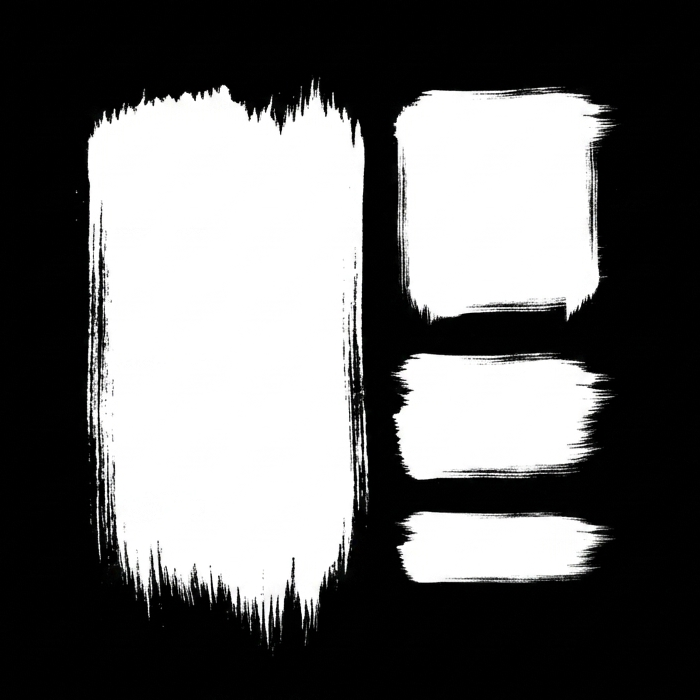

<p align="center">
  
</p>

<p align="center">
  
  
  
  
</p>

<p align="center">
  <strong>A fast terminal multiplexer for panes, tabs, and keyboard-first workflows.</strong>
</p>

# koshi

Koshi runs panes and tabs inside one terminal window. Each pane has its own
process, terminal screen, and scrollback.

## Requirements

- Linux, macOS, or Windows
- x86-64 or ARM64
- A terminal with true color and 256-color support
- Rust 1.96 to build from source

## Why Koshi?

Koshi keeps the core focused on terminal work. Panes, tabs, layouts,
keybindings, themes, and saved layouts are built in. App settings stay in
small KDL files, and shell commands can control a running session.

Three parts of the design are worth knowing before you start.

**Your keybindings stay on your machine.** The terminal you sit at reads your
own `keybinding.kdl`. It decides what each key means. It then sends the action
name and its arguments to the session. Press `<C-p> l`, and the session
receives `core:new-pane-right`. It never receives the key itself. A session on
another machine works the same way, so your own shortcuts follow you there.
You never edit a keybinding file on the other machine.

**Each attached terminal keeps its own view.** The focused pane, the active
tab, the zoomed pane, the scroll position, the text selection and the lock
mode belong to the terminal, not to the session. Two people attach to one
session at the same time. One switches to tab 2, and the other stays on tab 1.
Each one types into the pane they focused. Neither moves the other's screen.

**A session outlives the terminals that view it.** The session runs as its own
program. Close your terminal, and its panes keep running. Attach again later,
from the same machine or another one, and the panes are where you left them.

> [!IMPORTANT]
> One setting controls this. `auto-close-session` in `koshi.kdl` is `#false` by
> default, which keeps the session running after its last terminal leaves. Set
> it to `#true`, and the session ends instead: it asks every program in it to
> stop, waits up to three seconds, then kills what has not exited.
>
> The session reads this setting once, from the `koshi.kdl` on the machine it
> starts on. A terminal that attaches later cannot change it from its own file.
> See [config-docs/koshi.md](config-docs/koshi.md#auto-close-session).

## Features

- 🪟 **Split panes** — open panes left, right, up, or down; layouts fill the tab.
- 🗂️ **Stacked panes** — place several panes in one slot and switch the expanded pane.
- 🔍 **Fullscreen pane** — fill the tab with one pane and restore the prior layout.
- 📐 **Resize** — move borders by keyboard or drag them with the mouse.
- 📑 **Tabs** — create, close, move, and switch tabs.
- ⌨️ **Multi-key shortcuts** — use key sequences, a configurable leader, hints, and conflict checks.
- 🔒 **Lock mode** — send keys directly to the active program.
- 🖱️ **Mouse support** — focus panes, resize borders, scroll, and select text.
- 📋 **Clipboard copy** — copy mouse selections through OSC 52, including remote sessions.
- 🎯 **Mouse selection mode** — select text while a program owns mouse input.
- 👥 **Multi-client sessions** — attach several terminals to one session; each keeps its own focus, active tab, and zoom.
- 📜 **Per-pane history** — keep separate scrollback and scroll positions.
- 🧾 **Terminal support** — true color, text styles, alternate screens, CJK, emoji, and box drawing.
- 🎨 **Themes** — use the built-in colors or copy one of 25 included themes.
- ⚙️ **Config files** — keep app settings, themes, keybindings, and layouts separate.
- 💾 **Saved layouts** — start tabs, panes, commands, directories, and environment values from a profile.
- 🪵 **Logging** — write optional per-session text or JSON logs without terminal content.
- 🌐 **Remote sessions** — attach to a session on another machine over TLS, with a pinned certificate and an access token.
- 🔑 **Access tokens** — grant, revoke, and list the tokens that reach your sessions; each grant covers one session or every session.
- 🔁 **Reconnect** — a dropped remote link dials again for two minutes and puts your tabs, focus, and scroll position back.
- 👤 **Same-machine sharing** — let the other users of this machine list, attach to, and kill your sessions.
- ♻️ **Update in place** — `koshi update` restarts each running session into the new build, keeping its panes, their programs, and their scrollback.
- 🩺 **Installation check** — `koshi doctor` rates config, shell, terminal, directories, router, and remote access.
- 🌍 **Cross-platform** — run on Linux, macOS, or Windows; CI tests all three.

## Installation

### Linux

```bash
curl --proto "=https" --tlsv1.2 -sSfL \
  https://github.com/gohyuhan/koshi/releases/latest/download/install.sh | bash
```

### macOS

Install with the release script:

```bash
curl --proto "=https" --tlsv1.2 -sSfL \
  https://github.com/gohyuhan/koshi/releases/latest/download/install.sh | bash
```

Or install with Homebrew:

```bash
brew install gohyuhan/koshi/koshi
```

Homebrew adds the Koshi tap during installation. Upgrade Koshi with the other
outdated packages:

```bash
brew update
brew upgrade
```

Or upgrade only Koshi:

```bash
brew upgrade koshi
```

### Windows

Install with PowerShell:

```powershell
powershell -c "irm https://github.com/gohyuhan/koshi/releases/latest/download/install.ps1 | iex"
```

Or install with Scoop:

```powershell
scoop bucket add koshi https://github.com/gohyuhan/scoop-koshi
scoop install koshi/koshi
```

Upgrade Koshi after refreshing Scoop:

```powershell
scoop update
scoop update koshi
```

### Build from source

```bash
git clone https://github.com/gohyuhan/koshi.git
cd koshi
cargo build --release
./target/release/koshi
```

## Uninstall and clean removal

Exit every Koshi session before removing files.

### Linux

Remove a script-installed binary:

```bash
sudo rm -f /usr/local/bin/koshi
```

Remove all Koshi config, logs, update state, cache, runtime files, and the
remote data — the saved server secrets, the pinned certificates, and the access
tokens this machine granted:

```bash
rm -rf "${XDG_CONFIG_HOME:-$HOME/.config}/koshi"
rm -rf "${XDG_DATA_HOME:-$HOME/.local/share}/koshi"
rm -rf "${XDG_STATE_HOME:-$HOME/.local/state}/koshi"
rm -rf "${XDG_CACHE_HOME:-$HOME/.cache}/koshi"
rm -rf "/tmp/koshi-$(id -u)"
```

### macOS

For a script install:

```bash
sudo rm -f /usr/local/bin/koshi
```

For a Homebrew install:

```bash
brew uninstall --force koshi
brew untap gohyuhan/koshi
```

Remove all Koshi config, logs, update state, cache, runtime files, and the
remote data — the saved server secrets, the pinned certificates, and the access
tokens this machine granted:

```bash
rm -rf "$HOME/Library/Application Support/koshi"
rm -rf "$HOME/Library/Caches/koshi"
rm -rf "/tmp/koshi-$(id -u)"
```

### Windows

For a Scoop install:

```powershell
scoop uninstall koshi
scoop bucket rm koshi
scoop cache rm "koshi*"
```

For a PowerShell-script install, remove the PATH entry and install directory:

```powershell
$InstallDir = Join-Path $env:LOCALAPPDATA "koshi"
$UserPath = [Environment]::GetEnvironmentVariable(
    "Path",
    [EnvironmentVariableTarget]::User
)
$CleanPath = (($UserPath -split ";") | Where-Object {
    $_ -and $_ -ne $InstallDir
}) -join ";"
[Environment]::SetEnvironmentVariable(
    "Path",
    $CleanPath,
    [EnvironmentVariableTarget]::User
)
Remove-Item $InstallDir -Recurse -Force -ErrorAction SilentlyContinue
```

Remove all remaining Koshi config, logs, update state, cache, runtime files,
and the remote data — the saved server secrets, the pinned certificates, and
the access tokens this machine granted:

```powershell
Remove-Item (Join-Path $env:APPDATA "koshi") `
  -Recurse -Force -ErrorAction SilentlyContinue
Remove-Item (Join-Path $env:LOCALAPPDATA "koshi") `
  -Recurse -Force -ErrorAction SilentlyContinue
```

## Quick start

Open one tab with one shell pane:

```bash
koshi
```

Open a saved layout:

```bash
koshi --profile dev
```

### Default keybindings

The default leader is Ctrl.

| Keys | Action |
|---|---|
| `<C-p> n` | Open pane using configured direction |
| `<C-p> h` / `j` / `k` / `l` | Open pane left / down / up / right |
| `<C-p> x` | Close pane and its process tree |
| `<C-p> ←` / `↓` / `↑` / `→` | Focus nearby pane |
| `<C-s> ←` / `↓` / `↑` / `→` | Move pane border one cell |
| `<C-t> n` | Open tab |
| `<C-t> x` | Close tab |
| `Tab` / `Shift+Tab` | Next / previous tab |
| `Alt+f` | Toggle pane fullscreen |
| `<C-g>` | Toggle mouse selection |
| `<C-l>` | Lock or unlock input |
| `<C-q>` | Quit |

`koshi keys list` prints the active keymap. `koshi actions list` prints actions
that can be bound.

## Configuration

Koshi uses four optional KDL file types. Each present file must declare
`version 1`.

| File | Contents |
|---|---|
| `koshi.kdl` | Theme, pane, scrollback, layout, mouse, copy, terminal, logging, update, beta-feature, session-closing, other-user access, and remote access settings |
| `themes/<name>.kdl` | Koshi interface colors |
| `keybinding.kdl` | Keybindings and input modes |
| `profile/<name>.kdl` | Tabs, pane layouts, commands, directories, and environment values |

Config directories:

| Platform | Path |
|---|---|
| Linux | `~/.config/koshi` |
| macOS | `~/Library/Application Support/koshi` |
| Windows | `%APPDATA%\koshi\config` |

Available config commands:

| Command | Result |
|---|---|
| `koshi config path` | Print config directory |
| `koshi config explain <KEY>` | Print one setting's file, default, and meaning |
| `koshi config check` | Validate every known config file |
| `koshi config migrate` | Validate files and apply registered schema updates |

Current schema version is `1`. Migration leaves valid version `1` files
unchanged.

Full config reference: [config-docs/](config-docs/README.md). Ready-made themes:
[themes-example/](themes-example/).

## CLI reference

### Launching

| Command | Result |
|---|---|
| `koshi` | Start one session with one tab and shell pane |
| `koshi --profile <NAME>` | Start with `profile/<NAME>.kdl` |
| `koshi --headless` | Start a session with nothing attached, print its id, and return to the shell |
| `koshi --headless --allow-other-users` | The same, and let this machine's other users reach the session |

### Sessions and discovery

List and inspect commands accept `--format table` or `--format json`.
`NAME_OR_ID` takes the target's generated name or its printed id; an id is
never treated as a name, and a name several targets share is refused with
every matching id listed.

| Command | Result |
|---|---|
| `koshi list-sessions` | List running sessions, here and on every saved server that answers |
| `koshi attach [NAME_OR_ID]` | Attach this terminal to that session, or choose from the running ones, saved servers included |
| `koshi detach [CLIENT_OR_SESSION] [--all]` | Detach one terminal, or with `--all` every terminal of a session |
| `koshi kill-session [NAME_OR_ID]` | End that session, or the only running session |
| `koshi list-tabs [--session <NAME_OR_ID>]` | List tabs |
| `koshi list-panes [--session <NAME_OR_ID>]` | List panes |
| `koshi list-clients [--session <NAME_OR_ID>]` | List attached clients |
| `koshi inspect session <NAME_OR_ID>` | Show one session |
| `koshi inspect tab <NAME_OR_ID>` | Show one tab |
| `koshi inspect pane <PANE_ID>` | Show one pane |
| `koshi inspect client <CLIENT_ID>` | Show one client |

### Panes

Inside Koshi, omitted targets use the current session, tab, pane, or client.
Outside Koshi, give a target unless exactly one running session can be chosen.

| Command | Result |
|---|---|
| `koshi new-pane [--direction right\|down\|left\|up \| --stacked] [--pane <PANE_ID>] [--tab <NAME_OR_ID>] [--session <NAME_OR_ID>] [--client <CLIENT_ID>]` | Open a shell pane |
| `koshi run [new-pane options] -- <COMMAND>...` | Open a pane running one command |
| `koshi close-pane [--pane <PANE_ID>] [--force]` | Close a pane |
| `koshi resize-pane --direction <DIRECTION> [--size <SIZE>] [--pane <PANE_ID>]` | Move one pane border |
| `koshi focus-pane --pane <PANE_ID> [--client <CLIENT_ID>]` | Focus a pane |
| `koshi toggle-pane-fullscreen` | Toggle the focused pane's fullscreen view |
| `koshi input [--pane <PANE_ID>] [--no-enter] "<TEXT>"` | Send text to a pane |

### Tabs

| Command | Result |
|---|---|
| `koshi new-tab [--session <NAME_OR_ID>] [--client <CLIENT_ID>]` | Open a tab with one shell pane |
| `koshi close-tab [--tab <NAME_OR_ID>] [--session <NAME_OR_ID>] [--force]` | Close a tab |
| `koshi next-tab [--client <CLIENT_ID>]` | Focus the next tab |
| `koshi previous-tab [--client <CLIENT_ID>]` | Focus the previous tab |
| `koshi focus-tab (--index <INDEX>\|--tab <NAME_OR_ID>) [--client <CLIENT_ID>]` | Focus one tab |
| `koshi move-tab --index <INDEX> [--tab <NAME_OR_ID>]` | Move one tab |

Create commands print created ids. `new-pane` and `run` print one pane id.
`new-tab` prints its tab id and root pane id. `koshi --headless` prints its
session id.

### Input lock

| Command | Result |
|---|---|
| `koshi lock [--client <CLIENT_ID>]` | Send keys directly to the pane |
| `koshi unlock [--client <CLIENT_ID>]` | Restore Koshi shortcuts |
| `koshi toggle-lock [--client <CLIENT_ID>]` | Toggle locked input |

### Actions and shortcuts

| Command | Result |
|---|---|
| `koshi actions list [--format table\|json]` | List supported bindable actions |
| `koshi actions explain <ACTION> [--format table\|json]` | Explain one action and its targets |
| `koshi keys list [--mode <MODE>] [--scope default\|user\|session\|layout]` | List active shortcuts |
| `koshi keys describe "<KEY_SEQUENCE>"` | Explain one shortcut and its source |
| `koshi keys conflicts` | Report clashes, unreachable shortcuts, and warnings |
| `koshi keys validate <PATH>` | Check a keybinding file without applying it |

### Checking the installation

| Command | Result |
|---|---|
| `koshi doctor [--format table\|json]` | Check this machine's koshi installation |

One row per check, each with a verdict of `ok`, `warn`, or `fail`, the fact
behind it, and what to do about it. The whole answer prints either way: a run
holding a `fail` row exits 1, and a run of only `ok` and `warn` rows exits 0.

### Sharing and remote access

The global `--remote <SERVER>` flag runs one invocation against the machine
`SERVER` names instead of this one. It works with `attach`, with
`list-sessions`, and with the verbs that act on panes, tabs, and input.
Every other verb refuses it.

| Command | Result |
|---|---|
| `koshi share grant <IDENTITY> [--session <SESSION>] [--expires <DURATION>]` | Grant an identity a remote access token |
| `koshi share revoke <IDENTITY> [--session <SESSION>]` | Revoke the tokens an identity holds |
| `koshi share list [--session <SESSION>] [--format table\|json]` | List the tokens granted on this machine |
| `koshi attach --remote <SERVER> [--save-as <NAME>] [SESSION]` | Attach to a session on the machine `SERVER` names |
| `koshi list-sessions --remote <SERVER>` | List the sessions on the machine `SERVER` names |
| `koshi remote new` | Save a server, asking for its name, address and secret |
| `koshi remote edit <SERVER>` | Change one saved server's name, address or secret |
| `koshi remote list [--format table\|json]` | List the servers this machine has saved |
| `koshi remote forget <SERVER>` | Drop one saved server |
| `koshi remote set-secret <SERVER>` | Replace the secret of one saved server |

The `share` commands run on the machine holding the sessions; the rest run on
the machine connecting to it.

### Debugging

| Command | Result |
|---|---|
| `koshi debug dump-state [--format table\|json]` | Print every running session's sessions, tabs, panes, and clients |
| `koshi debug dump-layout [--tab <NAME_OR_ID>] [--format table\|json]` | Print each tab's split tree, solved rectangles, and per-client focus |

### Versions and updating

| Command | Result |
|---|---|
| `koshi version [--format table\|json]` | Print the build of the koshi program you just ran |
| `koshi server-version [--session <NAME_OR_ID>] [--format table\|json]` | Print the build each running koshi server runs |
| `koshi update` | Check for and install a newer release |

Each running session that can restarts into the new release, and then the
background process that tracks sessions does. A session keeps its panes, the
programs running in them and their scrollback, and an attached terminal rejoins
on its own. A session that refuses the restart is named on standard error and
keeps the old build.

`koshi server-version` is how you see that: one row per running server, so a
session still on the old build shows beside the ones that moved.

Full flags and output rules: [config-docs/cli.md](config-docs/cli.md).

## Changelog

See [CHANGELOG.md](CHANGELOG.md) for release history.

## License

MIT License. See [LICENSE](LICENSE).
